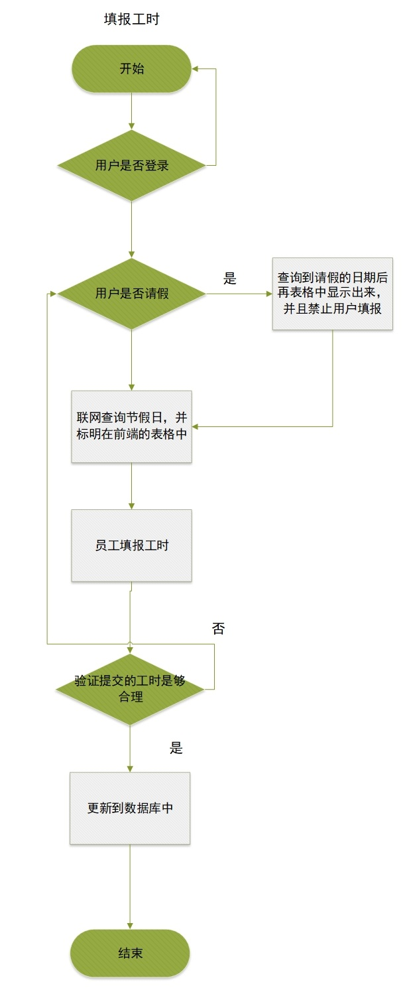
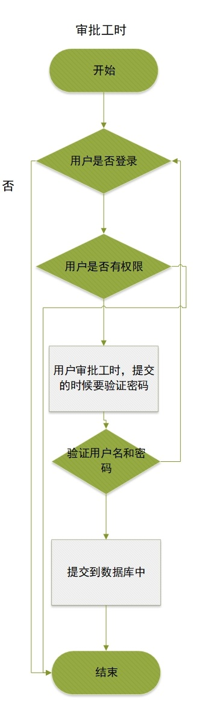
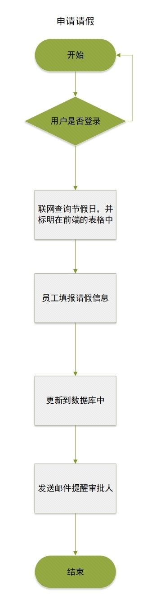
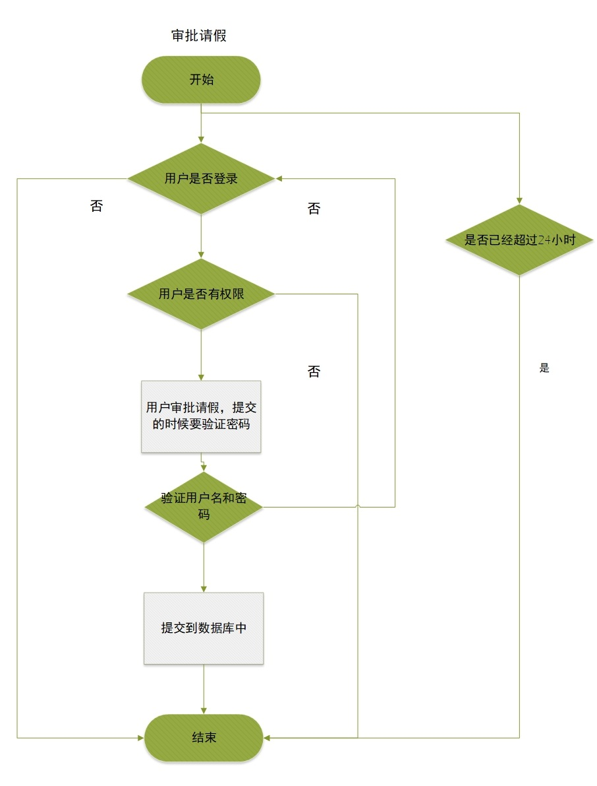
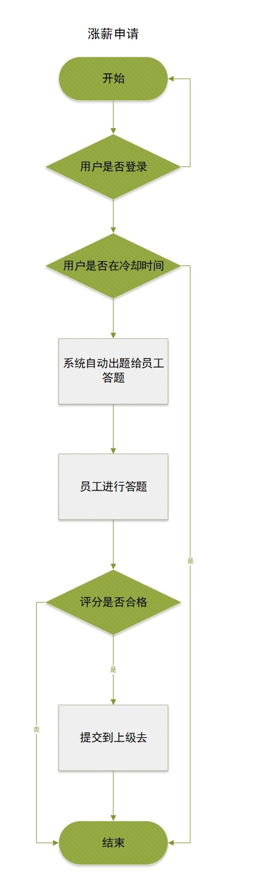
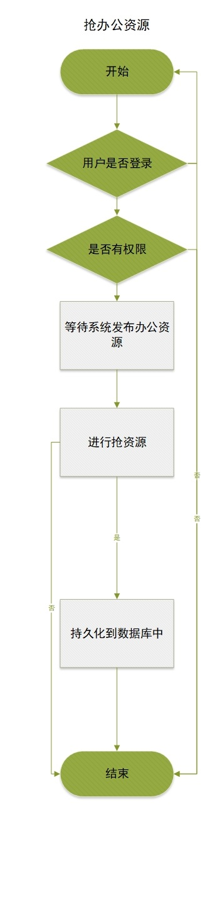
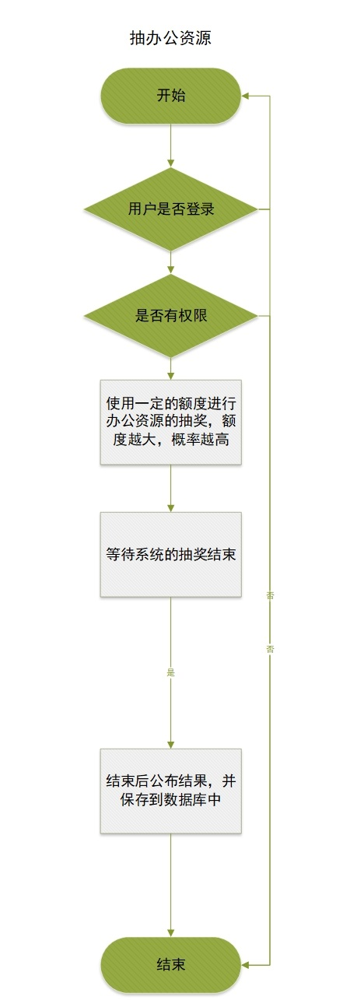
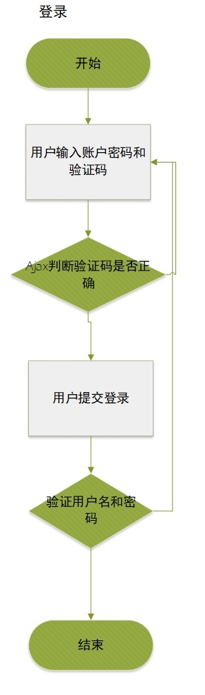

# OA自动化办公需求分析

[TOC]


## 摆正心态

	关于这次实训，我想将它作为一个可以作为我们面试的加分点的东西，所以这次我想玩一些比较新颖的东西，当然可能这会有一定的难度，但是这次是我们大四的最后一次课程了，此时不拼，更待何时。
	
	首先我们要摆正我们的心态，毕竟有两个月的时间在里面，没有什么是做不到的。还有一点，其实在企业中工作，一些人给你提需求的时候，别人并不会考虑你会不会这个技术，他只是把需求给你，然后其他的全部你自己设计，当然他可能会给多点时间给你，让你去弥补你现在的技术缺陷。所以我们的这个实训其实是跟企业里的工作差不多的。
	
	这次实训的项目，当然不会全部都是难的东西，有一部分是简单的，毕竟项目都是差不多的，不同的只是不同的业务场景，不同的业务逻辑；相同的业务用不同的技术去实现罢了，所以项目还是有很多简单的地方的，所以不用特别害怕。
	
	最后，希望大家能够互相帮助。遇到问题的时候，首先自己看下怎么解决，确实解决不了的时候再去问组员，组员可以帮你解决问题。不过切记一点，遇到同样的问题，必须在问过一次的情况下，能够自己解决，起码要和上次出现错误的场景不同，当然如果实在解决不了，那就直接问组员吧。相信这一次，我们要做出努力，绽放自己的光彩，争取能把这个项目作为以后找工作的亮点。

## 模块划分

### 工时统计

1. 员工填报工时
2. 相关负责人审核
3. 员工申请离职后的工时计算等
4. 员工的请假要扣减相应的工时

### 请假系统

这里主要用到的是发送邮件和消息提醒的功能，希望大家能够做好

1. 员工申请请假(这里采用 发送邮件进行提醒负责人，当然，最好就是在办公系统也能做到消息提醒)
2. 负责人进行审核(不论批假还是不批，都应该发送邮件给请假人发送结果，当然，最好就是在办公系统也能做到消息提醒)
3. 请假成功后向相应的组员发送提醒，然后让相应的组员能够帮忙做一下请假人的工作

### 薪资管理

工资的增删改查

1. 工资自动增长机制，通过工龄自动加相应的工资
2. 工资通过员工的绩效，发放相应的奖金，基础工资也会相应的提高
3. (**难点**)员工申请加薪，然后随机出题，让员工进行回答，可以是选择题，填空题，问答题(人工审批)，编程题(做最简单的)等，当员工能把题目做到一定的程度，这个申请才会到达审批人手里，然后审批人负责再次查阅答题情况，视情况加薪。

### 办公资源管理

这里想的是办公室的申请，公用车的分配等 办公资源管理

这里可以玩很多的形式，例如抢相应的资源，谁的手速快，办公资源就归谁。(**高并发**)

抽奖形式，可以分配一些额度给一定的人，然后大家用额度去进行抽奖，没有抽中的返回相应的额度，额度每天都会增加。然后就是进行随机抽奖，抽到谁，办公资源就归谁。

最后当然少不了的就是办公资源的人工分配

### 员工管理模块

1. 登录和注销
2. 权限控制
3. 记录员工的所有对数据库有修改的动作
4. 员工的部门管理，员工可以申请调离部门等

## 详细设计

### 工时统计

#### 员工填报工时

填报前提：登录状态，没有登录的用户要被拦截

员工可填报工时=一个月的工作日* 工作时间-请假时长

(难点)要自动的(联网)查询工作日，非工作日的时间不能填报工时

api接口

http://api.goseek.cn/Tools/holiday?date=20181008

免费申请nowapi的接口300次1小时免费试用

https://www.nowapi.com/api/life.workday

为了不让我们的接口浪费掉了，所以我们查询了api以后 要将数据存入到数据库中，每次查询工作日的时候，首先查询数据库中是否有相关的数据，没有的话再进行api调用，调用后把数据存入到我们的数据库中




#### 相关负责人审核

首先这里有一个关系，也就是部门负责人和员工之间的关系

部门负责人 进行部门内的人进行工时审批。当有审批任务的时候可以进行消息推送




#### 员工申请离职后的工时计算等

员工申请离职的时候，禁止员工继续填报工时，并且给账户一个有效期，在有效期过后自动封禁账户。离职的时候除了查询功能还能做之外，其他的所有功能都应该禁止。

#### 员工的请假要扣减相应的工时

就在请假的列表里，禁止员工填报

### 请假模块

#### 员工申请请假

员工输入请假的日期，自动的计算请假的天数，提交到服务器中，服务器通过邮件通知相关的人进行审核，24小时内未审批，则为申请成功。邮件里面放一个html ，负责人可以在邮件中的HTML进行审批，审批后提醒审批成功，同时通知到相应的员工。

具体实现：点击的是一个get请求，里面包含一个参数token，点击的时候回发送这个token值，然后通过token，查询到相应的请假， 然后进行审批。

除了邮件进行审批，也可以在系统中进行审批 所以这里需要一个数据表格







### 薪资管理

设计一个`部门`表，里面有所有部门

设计一个`职员`表，里面存放所有的职员的信息和名单。

设计一个`官职`表，里面有各部门所有的官职信息

薪资必须通过本部门专门管理薪资的人进行修改

当然也可以由部门之上的管理人通知提薪，然后本部门的人进行执行。

新增职员的时候，他的薪资由人工设定

员工可以查看自己的薪资，员工可以看到自己下个月将会获得的工资

每个小组要进行每个月的绩效评定，所以会有一个`绩效`的表

这里还要涉及到工龄的计算

随机出题，可以出单选题，多选题，填空题，甚至是编程题，最后一个如果能做尽量做

#### 答题判断正确实现

question 这里的设计格式为_为 填空的空

realanswer 这里的答案的格式为|这个为多个答案,&为多选题中的答案,少选不得分,$为第二个空的答案

例如a&b&C|b&c&d$aaads

private String answers; 以#分割 不同的选项


public boolean isRight(String... ans)；

首先规定 每一个数组元素是一个空的值

那么首先判断一个空的个数是够相同

也就是

```java
String [] realans=realanswer.split("$");
if (ans.length!=realans.length) {
    return false;
}
```

然后再判断每个选项是否相同

那么首先解析到每个空里面的每个答案

1. 把所有的可选答案解析出来，然后一个个判断可选答案
2. 依次对比可选答案，如果正确则进行下一个空的答案对比
3. 不正确则返回错误





### 办公资源管理

以抢的形式进行办公分配，所以这里会涉及到高并发，那么怎么进行高并发的设计呢？查看过一些资料，了解到目前并发的瓶颈是数据库的处理速度。12306一到春运的时候就会有很多网友在订票，当时他们为了解决这个并发的问题，去找各大数据库厂商，问他们能否解决这么大的并发量，但是没有一个数据库产商能够解决；ddos攻击也可以说是一个拒绝服务攻击，目的让他们的数据库繁忙起来，让真正的客户体验变得不好。逛了这么多的网站，我们也可看到很多网站的搜索都做了一个限制，3s之内不能连续搜索。

所以我们要解决数据库的问题，根据我在实验室的电脑测试过，插入数据1s中的并发量大概有750左右，但是查询的速度将会更慢。在实验室中，不进行数据库操作的1s并发量是7500左右，所以我们的并发量就做到4000左右。

首先先用一个redis保存一些中间结果，等抢结束后，在进行持久化到数据库中。

抽奖的形式进行争夺办公资源争抢，大家应该都玩过1元夺宝吧，就是使用这种形式进行抽奖。所以我们要给每个能申请的人给他们一定的抽奖值，然后让他们付出一定的抽奖值进行抽奖，抽中的人才会扣减值，没有抽中的抽奖值自动返还到原账户




#### 办公资源抽奖算法

总的值=所有额度值

随机抽取一个数在0-总的值

然后分为两半 一般为0-随机值 另一半为随机值-总的值

随机出一个数在0和1之间

0则选0-随机值

1则选随机值-总

依次类推，直到剩下最后一个





#### 办公资源买卖

谁也不能保证每次都抢到，谁也不能保证每次都抽到，就算是人工审批的申请，也会有不如意的时候，所以我们就做个买卖。让那些抢到资源的人可以卖出来赚部门外快，当然也可以让那些紧急使用的人可以获得办公资源，一举两得。


### 员工管理模块

增删改查

#### 登录

验证码可以是邮件，图片，登录密码要进行加密验证，Spring Security 里面有专门的密码加密器，spring设计的时候是防止暴力破解的，所以它的加密时间特别长，大概需要1s的时间才能加密1个密码，当然它也提供了接口，让我们自己去进行加密的操作




#### 权限控制

使用spring security进行权限控制，包括url拦截，方法拦截，基于html的拦截的话，好像并没有多大的作用，有时间的话可以试着来一下。

#### 操作记录

可以用AOP进行@Slf4j日记的记录

当然也可以在它操作数据库的时候先把操作存进数据库中

##  数据表格

### 部门表Department

| 字段名(field) | 类型           | 描述       |
| ------------- | -------------- | ---------- |
| id            | Integer        | id         |
| name          | String         | 部门名称   |
| employees     | List<Employee> | 部门的员工 |

这样子设计，可以直接的查找本部门的员工


### 员工表Employee

| 字段名(field) | 类型       | 描述                         |
| ------------- | ---------- | ---------------------------- |
| id            | String     | 员工id                       |
| password      | String     | 密码(存储的密码以加密的形式) |
| department    | Department | 部门                         |
| name          | String     | 姓名                         |
| email         | String     | 邮箱                         |
| entryTime     | Date       | 入职时间                     |
| position      | String     | 职位                         |
| status        | Integer    | 状态                         |
| leader        | Employee   | 上级                         |

这里我们可以直接找到自己的部门和职位，方便查询

### 部门任职表   已经删除，职位已经在员工的属性上面

| 字段名(field) | 类型    | 描述         |
| ------------- | ------- | ------------ |
| departmentId  | Integer | 部门id(外键) |
| employeeId    | Long    | 员工id       |
| position      | String  | 职位         |

### role角色表不要

在用户里面查看职位即可

### 权限表

后续设计

### 工时表Worktime

| 字段名(field) | 类型     | 描述     |
| ------------- | -------- | -------- |
| id            | Integer  | id       |
| employee      | Employee | 用户     |
| date          | Date     | 日期     |
| hour          | int      | 工作时间 |

在这里可以通过工时表去查找员工的工时传入员工的id即可查询工时

例如@Query("FROM WorkTime wt WHERE wt.employee.id =:id")

### 离职表Quit

| 字段名(field) | 类型     | 描述       |
| ------------- | -------- | ---------- |
| id            | Integer  | id         |
| employee      | Employee | 离职的员工 |
| applyDate     | Date     | 申请时间   |
| reason        | String   | 离职原因   |
| quitDate      | Date     | 离职时间   |

可以通过员工id查询员工的离职信息

这里要注意一点，员工申请离职的时候，要把员工表的状态修改以下

因为离职还需要一段时间进行交接任务，所以有个离职缓存期，所以实际的离职时间不一定是离职申请的时间

### 薪资发放表Salarypay

| 字段名(field) | 类型     | 描述                           |
| ------------- | -------- | ------------------------------ |
| id            | Integer  | id                             |
| employee      | Employee | 员工                           |
| date          | Date     | 发放日期                       |
| status        | Integer  | 状态 0代表未发放 1代表以及发放 |
| money         | Double   | 发放的钱                       |


### 薪资表Salary

| 字段名(field) | 类型     | 描述            |
| ------------- | -------- | --------------- |
| id            | Integer  | id              |
| employee      | Employee | 员工            |
| sal           | Double   | 基本工资        |
| bonus         | Double   | 奖金            |
| workMonth     | Integer  | 工龄 月份为单位 |
| worktimeMoney | Double   | 工龄工资        |
| subsidy       | Double   | 补贴            |


根据上面的属性进行计算工资，当然还要参照每个人的实际工时进行计算

计算公式=基本工资/当月的工作时间 x实际的工时+工作的天数x补贴 +奖金+工龄工资*工龄

工龄=现在时间-入职时间

奖金以出勤率作为计算

出勤率达到80%的拿奖金90%

90% 全拿奖金

70% 一半奖金

60%没有奖金

### 题库表Question

| 字段名(field) | 类型    | 描述                             |
| ------------- | ------- | -------------------------------- |
| question      | String  | 题目 题目中可能有_作为空         |
| realanswer    | String  | 标准答案                         |
| answers       | String  | 用于选择题的答案                 |
| type          | Integer | 题目类型0单选题 1多选题 2 填空题 |


## Extjs一些常用的方法

### 根据xtype查找

```js
Ext.ComponentQuery.query(selector, [root]) ：返回一个符合匹配的组件数组
```


### 根据id获取组件

```js
var ifield=Ext.getCmp("department_form_id");
//Ext.getCmp("id");
//itemid
//
var idField=win.getComponent("department_form_id");
//这个方法要用container才能使用,也就是动态加入的应该不起作用
//getComponent("itemid")

//根据设置的reference进行查找
this.lookupReference("reference");

```

### form内部查找

```js
//这里是xtype 的formobj的内部函数
formObj.getForm().findField(id/name);
```

### ajax的使用

file:///K:/%E8%B5%84%E6%96%99%E5%A4%A7%E5%85%A8/extjsApi%E6%96%87%E6%A1%A3/extjs/6.6.0/modern/Ext.data.Connection.html#method-request

```js
Ext.Ajax.request({
    url: 'http://localhost:8080/quit/deleteMore',
    method:'post',
    params:{id:ids},
     success: function(response, opts) {
         var obj = Ext.decode(response.responseText);
         console.dir(obj);
     },

     failure: function(response, opts) {
         console.log('server-side failure with status code ' + response.status);
     }
 });
```

ajax常用的参数

### PARAMETERS


`options` :  Object

An object which may contain the following properties:

(The options object may also contain any other property which might be needed to perform postprocessing in a callback because it is passed to callback functions.)

`url` :  [String](String.html) / [Function](Function.html)

The URL to which to send the request, or a function to call which returns a URL string. The scope of the function is specified by the `scope` option. Defaults to the configured `url`.

`async` :  [Boolean](Boolean.html)

`true` if this request should run asynchronously. Setting this to `false` should generally be avoided, since it will cause the UI to be blocked, the user won't be able to interact with the browser until the request completes. Defaults to `true`.

`params `:  [Object](Object.html) / [String](String.html) / [Function](Function.html)

An object containing properties which are used as parameters to the request, a url encoded string or a function to call to get either. The scope of the function is specified by the `scope` option.

method :  [String](String.html)

The HTTP method to use for the request. Defaults to the configured method, or if no method was configured, "GET" if no parameters are being sent, and "POST" if parameters are being sent. Note that the method name is case-sensitive and should be all caps.

`callback` :  [Function](Function.html)

The function to be called upon receipt of the HTTP response. The callback is called regardless of success or failure and is passed the following parameters:

options :  Object

The parameter to the request call.

success :  Boolean

True if the request succeeded.

response :  Object

The XMLHttpRequest object containing the response data. See [www.w3.org/TR/XMLHttpRequest/](http://www.w3.org/TR/XMLHttpRequest/) for details about accessing elements of the response.

`success` :  [Function](Function.html)

The function to be called upon success of the request. The callback is passed the following parameters:

response :  Object

The XMLHttpRequest object containing the response data.

options :  Object

The parameter to the request call.

`failure` :  [Function](Function.html)

The function to be called upon failure of the request. The callback is passed the following parameters:

response :  Object

The XMLHttpRequest object containing the response data.

options :  Object

The parameter to the request call.

scope :  [Object](Object.html)

The scope in which to execute the callbacks: The "this" object for the callback function. If the `url`, or `params` options were specified as functions from which to draw values, then this also serves as the scope for those function calls. Defaults to the browser window.

`timeout` :  [Number](Number.html)

The timeout in milliseconds to be used for this request. Defaults to 30000 milliseconds (30 seconds).

When a request fails due to timeout the XMLHttpRequest response object will contain:

```javascript
timedout: true
```

form :  [Ext.dom.Element](Ext.dom.Element.html) / HTMLElement / [String](String.html)

The `<form>` Element or the id of the `<form>` to pull parameters from.

isUpload :  [Boolean](Boolean.html)

**Only meaningful when used with the form option.**

True if the form object is a file upload (will be set automatically if the form was configured with **enctype** `"multipart/form-data"`).

File uploads are not performed using normal "Ajax" techniques, that is they are **not** performed using XMLHttpRequests. Instead the form is submitted in the standard manner with the DOM `&lt;form&gt;` element temporarily modified to have its [target](https://developer.mozilla.org/en-US/docs/Web/API/HTMLFormElement/target) set to refer to a dynamically generated, hidden `&lt;iframe&gt;` which is inserted into the document but removed after the return data has been gathered.

The server response is parsed by the browser to create the document for the IFRAME. If the server is using JSON to send the return object, then the[Content-Type](https://developer.mozilla.org/en-US/docs/Web/HTTP/Headers/Content-Type) header must be set to "text/html" in order to tell the browser to insert the text unchanged into the document body.

The response text is retrieved from the document, and a fake XMLHttpRequest object is created containing a `responseText` property in order to conform to the requirements of event handlers and callbacks.

Be aware that file upload packets are sent with the content type [multipart/form](https://tools.ietf.org/html/rfc7233#section-4.1) and some server technologies (notably JEE) may require some custom processing in order to retrieve parameter names and parameter values from the packet content.

- [target](http://www.w3.org/TR/REC-html40/present/frames.html#adef-target)
- [Content-Type](http://www.w3.org/Protocols/rfc2616/rfc2616-sec14.html#sec14.17)
- [multipart/form](http://www.faqs.org/rfcs/rfc2388.html)

headers :  [Object](Object.html)

Request headers to set for the request. The XHR will attempt to set an appropriate Content-Type based on the params/data passed to the request. To prevent this, setting the Content-Type header to `null` or `undefined` will not attempt to set any Content-Type and it will be left to the browser.

xmlData :  [Object](Object.html)

XML document to use for the post. Note: This will be used instead of params for the post data. Any params will be appended to the URL.

jsonData :  [Object](Object.html) / [String](String.html)

JSON data to use as the post. Note: This will be used instead of params for the post data. Any params will be appended to the URL.

rawData :  [String](String.html)

A raw string to use as the post. Note: This will be used instead of params for the post data. Any params will be appended to the URL.

binaryData :  [Array](Array.html)

An array of bytes to submit in binary form. Any params will be appended to the URL. If binaryData is present, you must set [binary](Ext.data.Connection.html#cfg-binary) to `true` and options.method to `POST`.

disableCaching :  [Boolean](Boolean.html)

True to add a unique cache-buster param to GET requests.

withCredentials :  [Boolean](Boolean.html)

True to add the withCredentials property to the XHR object

username :  [String](String.html)

The username to pass when using `withCredentials`.

password :  [String](String.html)

The password to pass when using `withCredentials`.

binary :  [Boolean](Boolean.html)

True if the response should be treated as binary data. If true, the binary data will be accessible as a "responseBytes" property on the response object.

### extjs时间格式化

```js
Ext.util.Format.date(日期控件.getValue(), 'Y-m-d');
```


### js 删除json中的某个字段

```js
删除json下指定的元素 
var obj = {‘id’:1, ‘name’:2}; 
delete obj.id; 
delete obj[id]; 
```

### extjs 修改css的内容

很多时候我们要通过js进行修改某些元素的显示效果，例如头像的显示，点击后元素改变显示效果等

这里都是通过一个方法进行去修改一个这个元素的某个css的属性

```js
//元素 .setStyle({}),就可以进行修改css属性了
grid.setStyle({"background-color":"red"});
```


### extjs 改变背景

使用属性 bodyStyle

```js
bodyStyle: {
    background: '#ffc',
    padding: '10px'
}
```

当然也可以使用style属性

```js
style: {
    'border-left': '1px solid red'
}
```

### extjs也可以进行数据绑定

数据绑定的相关内容

https://blog.csdn.net/sushengmiyan/article/details/38612721

```js
viewModel: {
            type: "binding-two-way-formulas",
            data: {
                title: "我是标题",
                x: 1,
                birthDate: new Date(1992, 0, 17)
            }
        }
原文：https://blog.csdn.net/qq_20282263/article/details/54583704?utm_source=copy 
```

在viewModel中定义了data的数据就可以进行数据绑定

### extjs 窗口不能全屏的问题

window里面有一个问题就是，当我们加入到container的时候，会不能显示的问题

解决方法就是直接加一个autoShow :true 就可以解决了

## java中的使用


### 获取项目路径

```java
File directory = new File("");
System.out.println(directory.getAbsolutePath());
```

### 获取运行时候的路径

```java
System.out.println(this.getClass().getClassLoader().getResource(""));
```


itemid的使用

## 项目中遇到的一些问题总结

### 2018/09/25

extjs今天完全运行不起来，出现这个问题的原因是因为git忽略了一些target/这个文件夹中

这里我添加了一个忽略maven的东西的文件，然后extjs中也有一个target的文件夹，里面存放了一些必备的js文件

这样就会导致extjs完全运行不起来

`解决方案`就是把**target改为项目名/target/**这样就不会让extjs出问题了

如果有多个项目，我们就添加多个忽略的规则

还有一些组员出现了一个问题，就是实体对象在创输到前端，对象成环的问题，还有懒加载异常的问题


## 任务详细分工

以前的模块划分有点乱，大家的任务量也不平均，所以现在进行重新详细划分一下吧

### 数据表格维护

数据表格的维护包括增删改查，以及相关的业务逻辑实现等等

目前维护的数据表格如下


Mr Yang:

- 员工表

M Huang

- 工时表 
- 问题表 

Mr Zhao

- 请假表

Mr Zhu

- 工资发放表
- 部门表
- 离职表

还有一些没有维护的表

例如办公资源表

我们现在的进度有点慢，经过了两个星期才做完增删改查

所以现在重新划分一下详细的分工

Mr Yang 做的模块改一下

Mr Yang 维护员工表、部门表。

要完成的功能有 员工换部门，部门添加员工、部门删除员工、部门的职位维护、头像上传等


Mr Zhao 维护请假表、办公资源表、实现办公资源的逻辑

办公资源的增删改查，抢办公资源，分配办公资源、抽办公资源、甚至是办公资源买卖

Mr Huang 维护问题表、工时表、一些衍生出来的表 工作日表、试卷表

实现为员工添加工时、员工申报工时。工时审批等。。。

Mr Zhu 维护工资发放表、离职表。

目前先按照这个进行维护和实现业务逻辑。


未完成任务如下：

1. 自动发工资
2. 最勤快排行榜 分部门 和所有人进行
3. 加班排行榜 
4. 加班率统计
5. 离职审批的权限加强
6. 权限完全控制


